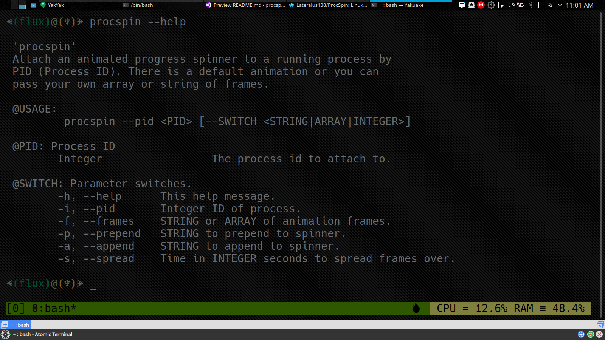

# ProcSpin

Customize silent running processes with frame animations and text in Linux Bash shells.


Several fixes and a refactor coming soon, please bare with me. Almost done.

## Table of Contents
- [ProcSpin](#procspin)
  - [Table of Contents](#table-of-contents)
  - [Description](#description)
  - [Motivation](#motivation)
  - [Dependencies](#dependencies)
  - [Usage](#usage)
    - [Script](#script)
      - [Sourceable Script](#sourceable-script)
        - [Dot Method](#dot-method)
        - [Source Method](#source-method)
        - [Sourced Function Example](#sourced-function-example)
      - [Executable Script](#executable-script)
    - [AppImage](#appimage)
      - [Executable AppImage](#executable-appimage)
    - [Arguments](#arguments)
      - [Argument Switches](#argument-switches)
        - [Argument PID](#argument-pid)
        - [Argument Frames](#argument-frames)
    - [Bash Completion](#bash-completion)
    - [Animation Frames](#animation-frames)
      - [Default Animation Frames Example](#default-animation-frames-example)
      - [Moving Arrows Animation Frames Example](#moving-arrows-animation-frames-example)
  - [Example](#example)
  - [Files](#files)
    - [Project Links](#project-links)
    - [Direct Links](#direct-links)
  - [Media](#media)
    - [Help Message](#help-message)
    - [Screenshot](#screenshot)
    - [Logo](#logo)
    - [Video](#video)
      - [YouTube](#youtube)
  - [Project Stats](#project-stats)
  - [LICENSE](#license)

## Description

This ***Linux Bash*** *command line* utility can attach itself to any process by PID and run a custom animation of frames by string or array with the addition of prepended and appended text with the animation and the ability to change the speed of the animations by spreading the frames over seconds with the '-s' switch (e.g. -s 3, spreads over 3 seconds). This is great for silent processes, especially in sub shells or scripts. This tool works with any color and otherformatting that can be used with `printf`.

## Motivation

I work in many shells for many reasons and not everything I do has verbose output (of course) and sometimes it's nice to have something visual to represent what's going on in the background. If for anything else, but to know if it's still runing or not without having to type a command.

## Dependencies

'ProcSpin' is a utility written specifially for the `Bash` environment in `GNU`/`Linux` and is dependant only on the utilities and libraries that are already provided in said environment.

## Usage

This is a command line/shell/terminal/console utility written specifically for the **Linux Bash** environment and as such can be used in any method that you can use any other executable bin or script in said environment.

This program comes in 3 forms:

1. A sourceable and executable script.
2. A function that can be pull from the script.
3. An executable *AppImage*.

### Script

The script can be sourced and used as a function (or the function can be stripped and used wherever you like) or it can be used by normal script execution. Sourcing the script provides *Bash Completion*.

You can, of course, name the script to anything you like.

#### Sourceable Script

To source the files and use the function with Bash Completion:

##### Dot Method
```Bash
 $ . /path/to/procspin.bash
```

or

##### Source Method

```Bash
 $ source /path/to/procspin.bash
```

##### Sourced Function Example

Then use the function with Bash Completion in your terminal:

```Bash
# Run silent sub-shell command with the default spiner, but added text.
(silent_command_script_or_executable) & procspin -i $! -p " prepended text [" -a "] "
```

#### Executable Script

No Bash Completion unless you copy the completion code into your own configs from my provided 'complete' code in the script.

```Bash
# Run silent sub-shell command with the default spiner, but added text.
(silent_command_script_or_executable) & ./procspin.bash $! -p " prepended text [" -a "] "
```

### AppImage

The `AppImage` is only executable and used exactly like the executable script above. All AppImages can be renamed to something easier and especially removing the *.AppImage* extension. This is just another delivery method in which some people prefer.

#### Executable AppImage

```Bash
# Run silent sub-shell command with the default spiner, but added text.
(silent_command_script_or_executable) & ./procspin-x86_64.AppImage $! -p " prepended text [" -a "] "
```

### Arguments

#### Argument Switches
|Switch|Switch - Alt|Description|
|:---:|:---:|:---:|
|-h|--help|This help message.|
|-i|--pid|Integer ID of process.|
|-f|--frames|STRING or ARRAY of animation frames.|
|-p|--prepend|STRING to prepend to spinner.|
|-a|--append|STRING to append to spinner.|
|-s|--spread|Time in INTEGER seconds to spread frames over.|

##### Argument PID

|Example|Description|
|:---:|:---:|
|2345 (any integer)|Direct PID|
|$$|PID of current shell.|
|$!|PID of last ran process/sub-shell.|

##### Argument Frames

|Example|
|:---:|
|array=('>   ',' >  ','  > ','   >')|
|A comma delimited array of animation frames where you can create positional animations by creating each `frame` the same character length and, of course, filling empty spaces with spaces. |

### Bash Completion

As stated above *Bash Completion* is provided when sourcing the script, but it can also be added to any of your 'profile' or 'dot' configs by pasting the following code (or from the script) into your own files.

```Bash
    complete -W "-h --help -a --append -p --prepend -s --spread" procspin
```

### Animation Frames

This comes with a default animation embedded as an array in the main function, but with the `-f,--frames` switch you can use your own set from a string or array of your own characters. These can be single or multiple characters usually using spaces to as empty space where there's not character at that specific frame as I will show you in the example. When using multi-character animations I recommend using arrays of strings rather than trying to format a long string. I really recommend using arrays at all times, but you do what you like, of course.

`NOTE`: These default frames may or may not display in some browsers or in a small amount of terminals, but they work in most places and can easily be changed in both the function and by providing your own.

#### Default Animation Frames Example

```Bash
array=('','','','','','','','','','','' \
				'','','','','','','','','','','','','','')
```

#### Moving Arrows Animation Frames Example

```Bash
frame_array=(\
'▶               '\
,' ▶              '\
,'  ▶             '\
,'   ▶            '\
,'    ▶           '\
,'     ▶          '\
,'      ▶         '\
,'       ▶        '\
,'        ▶       '\
,'         ▶      '\
,'          ▶     '\
,'           ▶    '\
,'            ▶   '\
,'             ▶  '\
,'              ▶ '\
,'               ▶')
```

## Example

Silently run `find` to log all files to a file with a custom animation with the above frames (after enabling `sudo` with some other command, of course):

```Bash
 $ (sudo find / > ~/files.log 2>/dev/null) & procspin -i $! -p " <~ Running 'find'... ~> [" -a "] " -f "${frame_array[@]}"
[4] 53354
 <~ Running 'find'... ~> [               ▶]
```

## Files

The best thing to do is to choose the script or AppImage from the 'Continuous Release" page as that should be the most updated versions of each, but the files from the 'Direct Links' should reflect the same versions.

### Project Links

|What|Link|
|:---:|:---|
|Continuous Release - Recommended|[https://github.com/Lateralus138/ProcSpin/releases/tag/Continuous](https://github.com/Lateralus138/ProcSpin/releases/tag/Continuous)|
|This Repo - Themed|[http://lateralus138.github.io/ProcSpin](http://lateralus138.github.io/ProcSpin)|
|This Repo|[https://github.com/Lateralus138/ProcSpin](https://github.com/Lateralus138/ProcSpin)|
|OpenDesktop/Pling|[https://www.pling.com/p/1435385/](https://www.pling.com/p/1435385/)|

### Direct Links

|File|Description|
|:---:|:---:|
|[procspin.bash](dist/script/procspin.bash)|Main Bash script.|
|[procspin-x86_64.AppImage](dist/appimage/procspin-x86_64.AppImage)|AppImage format.|

## Media

### Help Message



### Screenshot


### Logo


### Video

#### YouTube

|Link|Description|
|:---:|:---|
|[ProcSpin Demo 1](https://www.youtube.com/watch?v=ePHORw8x6IQ)|My special `APT` Update script.|
|[ProcSpin Demo 1](https://www.youtube.com/watch?v=P_BFhdxi89I)|Random demonstration.|


## Project Stats

|`Build`|`Status`|
|---:|:---|
![Build Status](https://img.shields.io/static/v1?logo=data:image/png;base64,iVBORw0KGgoAAAANSUhEUgAAAA4AAAAOCAMAAAAolt3jAAAABGdBTUEAALGPC/xhBQAAACBjSFJNAAB6JgAAgIQAAPoAAACA6AAAdTAAAOpgAAA6mAAAF3CculE8AAAB11BMVEUAAAA9U2GDnayLpraOqLeQqbiRqriPqLaPqLaRqriDnaw9U2Fid4SKp7iKp7hid4RfdYGHpbdYbnuCorRSaHV9nrFMYm93ma1HXGlwlKlwlKlBV2NojqQ7UV1hiKA2S1hYgpswRlJQfJcwRlIkMjlDbIVMfJpNfptOfptNfZpRfplTf5lMfJlOfptNfptDbIUkMjkHAAAuR1YzUWMzUWMzUmM0UmQzUWMyUWM0UmQzUmMzUWMzUWMuR1YHAACNsMWRs8aXt8mbuMm3ydSbuMmRs8aIrsONscWStMeZtsfk6u3k6u2ZtseStMeIrsOGrMKKr8SMr8Oswc3u8PHu8PGswc6Mr8OCqcCFrMKJrsOTssTT3OLS3OKTssSJrsOCqcB9pr5/p7+CqcCApryYs8Sdt8aApryCqb9/p799pr52obp4o7x9o7qswc7F09vO2eCwxNCCp7x4ort2obpvnLdxnbd9orjK1t3T3OLK1t7Y4OSFp7twnLZvnbdomLRolrKTsMHb4eWju8mRrsDd4+aiushplrJomLRhkrBik7Bmkq25ydLY3uLW3eHI09ptl69hkrBhkrBZjq1bj65ej613nbSRrr+etsV3nbRika1bjq5Zjq3///97NWaUAAAAP3RSTlMAAlOMioqKioqKUwIMwcEMDsQOxA7EDsQOxMQOxA7EDsQOxA4Lq/Lv7+/v7+/v76sLASI+Pj4+Pj4+Pj4+IgH2SccMAAAAAWJLR0SccbzCJwAAAAd0SU1FB+QIGBYnM5liyzQAAADPSURBVAjXY2BABYxMzCysbOwcnKwszFzcDDy89g6OTs7OLo6u9nz8DAKCbu4enl7ePr7ufoICDELC/gGBQcEhoWEB/sJCDCKi4RGRUdExsXER8aIiDGLiCYlJySmpaekZmeJiDBKSWdk5uXn5BYVFxVISDNIyJaVl5RWVVdU1tTLSDLJydfUNjU3NLa1t7XKyDPIKHZ1d3T29ff0TJirIMygqTZo8Zeq06TNmzpqtpMygoqqmrqGppa2jq6emb8BgaGRsYmpmbmFpZW1jawcAIDgy9UQeYeoAAAAldEVYdGRhdGU6Y3JlYXRlADIwMjAtMDgtMjRUMjI6Mzk6NTEtMDQ6MDBWWeqAAAAAJXRFWHRkYXRlOm1vZGlmeQAyMDIwLTA4LTI0VDIyOjM5OjUxLTA0OjAwJwRSPAAAAABJRU5ErkJggg==&label=AppImage&message=Status&color=b91d47&style=for-the-badge&labelColor=1d1d1d)|

## [LICENSE](LICENSE)

>This program is free software: you can redistribute it and/or modify it under the terms of the GNU General Public License as published by the Free Software Foundation, either version 3 of the License, or (at your option) any later version.

>This program is distributed in the hope that it will be useful, but WITHOUT ANY WARRANTY; without even the implied warranty of MERCHANTABILITY or FITNESS FOR A PARTICULAR PURPOSE.  See the GNU General Public License for more details.
